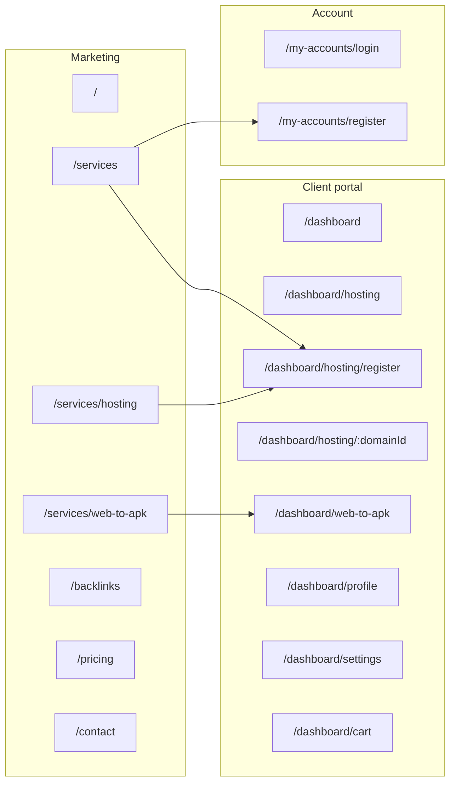

# Landing app UI — master index (read first)

**Scope:** [`apps/landing`](../) (Vite + React). Client portal, marketing site, and `/my-accounts` auth live in this package.

## Read order for AI / maintainers

1. This file (routing map and links).
2. **Client dashboard (all `/dashboard/*`):** [`src/pages/dashboard/DASHBOARD_PORTAL.md`](../src/pages/dashboard/DASHBOARD_PORTAL.md)
3. **Domain & hosting (portal only `/dashboard/hosting/*`):** [`src/pages/dashboard/HOSTING_PORTAL.md`](../src/pages/dashboard/HOSTING_PORTAL.md) — also [`UI_DOMAIN_HOSTING_PORTAL.md`](UI_DOMAIN_HOSTING_PORTAL.md)
4. **Public marketing (`/`, `/services`, …):** [`src/MARKETING_LANDING.md`](../src/MARKETING_LANDING.md) — also [`UI_MARKETING_SEO_SERVICES.md`](UI_MARKETING_SEO_SERVICES.md)
5. **Auth (`/my-accounts/*`):** [`src/pages/portal/ACCOUNT_PORTAL.md`](../src/pages/portal/ACCOUNT_PORTAL.md)

## Route map

## Key source locations

| Area | Routes | Data / docs |
|------|--------|-------------|
| Marketing SEO services | `/services`, `/backlinks`, `/pricing` | [`lib/constants.ts`](../src/lib/constants.ts), [`lib/api.ts`](../src/lib/api.ts) — see UI_MARKETING_SEO_SERVICES |
| Marketing hosting product | `/services/hosting` | [`data/marketingHosting.ts`](../src/data/marketingHosting.ts), plans in [`data/mockHosting.ts`](../src/data/mockHosting.ts) |
| Marketing Web→APK | `/services/web-to-apk` | [`data/mockWebToApk.ts`](../src/data/mockWebToApk.ts) |
| Portal hosting | `/dashboard/hosting/*` | `mockHosting.ts`, `mockHostingStore.ts`, [`routes/paths.ts`](../src/routes/paths.ts) |
| Portal Web→APK | `/dashboard/web-to-apk` | [`data/mockWebToApk.ts`](../src/data/mockWebToApk.ts) |
| Portal profile | `/dashboard/profile` | [`data/mockProfile.ts`](../src/data/mockProfile.ts) |
| Portal security | `/dashboard/settings` | [`data/mockSecurity.ts`](../src/data/mockSecurity.ts) |
| Dashboard cart | `/dashboard/cart` | `stores/cartStore.ts`; header flyout: `components/portal/CartFlyout.tsx` |

## Shared UI tokens

[`src/lib/ui.ts`](../src/lib/ui.ts) — `accountInputClass`, `ui` object; dashboard tables use [`ResponsiveSplit`](../src/components/dashboard/ResponsiveSplit.tsx) (`NarrowWide`).

## Implementation task lists

**Start here:** [`TASKS_INDEX.md`](TASKS_INDEX.md) — links to:

- [`TASKS_UI_UTILS_COMPONENTS.md`](TASKS_UI_UTILS_COMPONENTS.md) — UI utils and component extraction checklist
- [`TASKS_MOCK_CRUD_MATRIX.md`](TASKS_MOCK_CRUD_MATRIX.md) — mock data CRUD coverage matrix
- [`TASKS_PROFILE_SECURITY.md`](TASKS_PROFILE_SECURITY.md) — Profile & Settings pages + API gaps
- [`TASKS_WEB_TO_APK.md`](TASKS_WEB_TO_APK.md) — Web→APK service implementation + API integration checklist
- [`TASKS_RESPONSIVE_AUDIT.md`](TASKS_RESPONSIVE_AUDIT.md) — per-page responsive/mobile checklist
